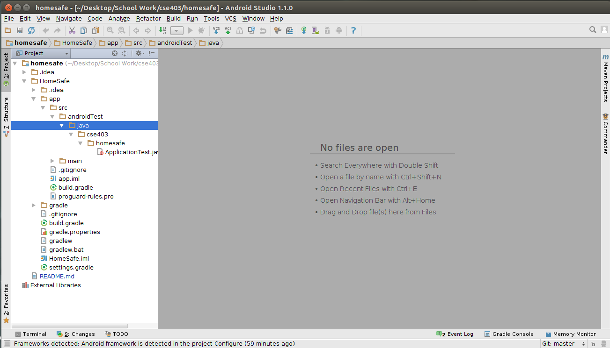
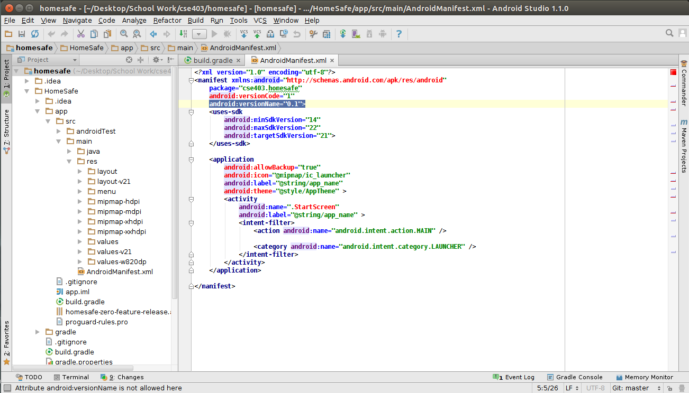
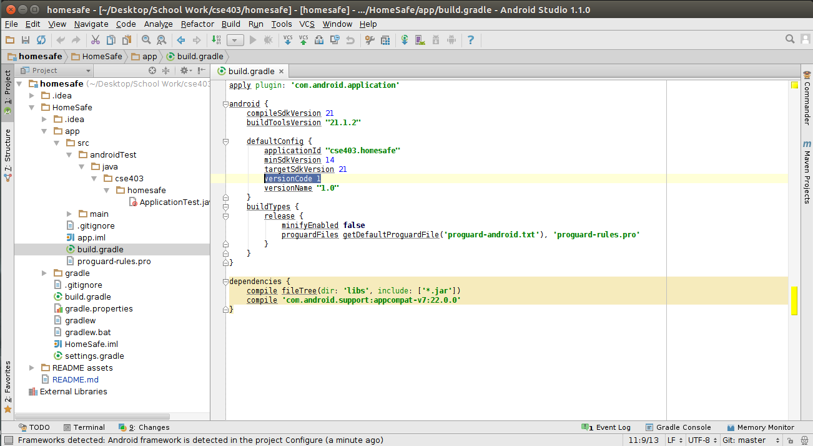

The <i>original</i> Software Requirements Specification is located [here](https://drive.google.com/file/d/0B7Qa-eLpQZL2b093UHI0aVk1ZHM/view?usp=sharing).
The <i>updated</i> SRS -- contained in a single document -- can be found [here](https://drive.google.com/open?id=1oygRUxuyMpw9emZNEf7O103dDs92CsdnTmK7E975e1Q&authuser=0) (note: only the use cases were slightly altered).

The <i>original</i> Software Design Specification is located [here](https://drive.google.com/open?id=0B7Qa-eLpQZL2VXRUTlNBaGk1a00&authuser=0).
The <i>updated</i> SDS can be found [here](https://drive.google.com/file/d/0B4eVFDvqMnKhS191UXlJYWFfems/view?usp=sharing)

Our User Testing Feedback Analysis is located [here](https://drive.google.com/open?id=0B4eVFDvqMnKhV2ktRXdvU1BtaUU&authuser=0)

A Code Review Document discussing the changes which lead to the birth of the GoogleGPSUtils class can be found [here](insertLink)

The Design Changes and Rationale Document is located in the Design Changes and Rationale Directory in this repository.

Homesafe - Developer Documentation
========
###Table of Contents
1. New to HomeSafe
2. Getting Started
 * Downloading APK
 * Cloning the repository
 * Building HomeSafe
3. Developing HomeSafe
 * Testing
 * Automated Builds and Testing
 * Releasing a New Version
 * Report a bug

###New to HomeSafe?
New to the HomeSafe security app? Read the [short product description](https://docs.google.com/document/d/1mRl2jZ4gIVV2BKpTckHCqAkJ_6wEhcdgAwXyakDqQ3E/edit "HomeSafe product description") to find out more about it!

###Getting Started
The HomeSafe Security app is an open-source safety app for Android devices. In order to use the app or contribute to the project, you will first need to download the repository from the Github webpage:
* Never used Github before? No problem, start [here](https://github.com/ "Github")!
* For everyone else here's a handy [Github cheatsheet](https://training.github.com/kit/downloads/github-git-cheat-sheet.pdf "Github cheatsheet")!

###Downloading APK
You may download the built APK under HomeSafe/app.

###Cloning the Repository
Open a terminal window (or a Git terminal window for non-Linux users) and enter
```
git clone https://github.com/HomeSafe/homesafe
```
this will create a local copy of the HomeSafe repository on your machine so you will now have access to the most recent copy of the source code.

Before you start adding code or making changes, open your copy of the homesafe repository and make sure that you have all the following items:
```
$ cd homesafe/
$ ls
  HomeSafe  homesafe.jks  README assets  README.md
$ cd HomeSafe/app/src/
$ ls
  androidTest  main
$ cd main
$ ls
  AndroidManifest.xml  java  res
$ cd java/cse403/homesafe
$ ls
  Data  HSTimer.java  Messaging  StartScreen.java  Trip.java
```
Note that in the homesafe folder there's a file titled README.md which is a copy of the document you're reading right now.

P.S. if there are any problems at all grabbing the HomeSafe material using git then you can also use the following [link](https://github.com/HomeSafe/homesafe/archive/master.zip "Download HomeSafe files") to download a zipped version of the HomeSafe source code folder.

###Building HomeSafe
There are several options for this step that all boil down to the preference of you, the developer. Android apps are all written in Java; in order to compile and run the HomeSafe source code you need both the [Android SDK](https://developer.android.com/sdk/index.html "Android SDK") and an IDE. Two staple Android dev IDEs are [Eclipse](https://eclipse.org/ "Eclipse") and [Android Studio](https://developer.android.com/tools/studio/index.html "Android Studio"). Both Eclipse and Android Studio are powerful tools to run Android Java code and have features to test code on both Android devices or emulators. It's super neat and easy to get started with either of these if you don't have either installed. If you've never used either tool before, try to spend a half an hour to learn how to use them before continuing on.

Once you are inside your chosen IDE (Android Studio is used for demonstration in this tutorial) open the project folder; the actual java source code is located in the HomeSafe/app/src/main/java/cse403/homesafe folder and all the layout source files you might need are located in the HomeSafe/app/src/main/res. Any user documentation you might need is on the [HomeSafe website](http://homesafe.github.io/ "HomeSafe website"), please read it if you need a high-level view of the product.



When you first open the project folder in your IDE you should get a file structure similar to the one shown in the above picture.

Once you have added any code you want and are ready to build, locate and press the build button in your IDE (in Android Studio it is under the Build menu). You can then run the code and test it in an [Android Device Emulator](http://developer.android.com/tools/devices/emulator.html).

###Testing Your Software and Not Breaking Ours
Testing is very important (especially if you plan to add your code to our code). Please test your code thoroughly and make sure it builds and runs correctly before adding it to the repository. **DO NOT ADD BROKEN CODE**. If you don't know where to start in terms of testing here are a few handy sites to get you started:
* [Android testing](http://tools.android.com/tech-docs/unit-testing-support)
* [JUnit Testing](http://www.javacodegeeks.com/2014/11/junit-tutorial-unit-testing.html)
* [JUnit Testing in Eclipse](http://help.eclipse.org/luna/index.jsp?topic=%2Forg.eclipse.jdt.doc.user%2FgettingStarted%2Fqs-junit.htm)

To run the whole test suite at once, navigate to the project's top-level directory (homesafe/HomeSafe). From here, you can run the command:
```
$ ./gradlew test
```
This will build and run all tests. Once the tests have completed, you may find a detailed report in the file
```
app/build/outputs/reports/androidTests/connected/index.html.
```
If you'd like to run individual tests, you'll find core class JUnit tests in app/src/main/java/UnitTests/ and Activity unit tests in app/src/androidTest/java/cse403/homesafe/test/.

To run individual tests from Android Studio, you'll need to manually switch back and forth between the two modes: unit testing mode and instrumentation testing mode. If you're running Android Studio 1.1 or below, make sure unit testing is enabled first by going to Preferences > Build Tools > Gradle > Experimental and ticking the Unit Testing box (this step is unnecesssary in newer versions).

To run unit tests, go to View > Tool Windows > Build Variants and pick Unit Tests in the dropdown. To run instrumentation (i.e. Activity) tests, switch it to Instrumentation Tests.

###Setting Up Automated Builds and Tests
Building and testing can be a pain; if you're interesting in setting up automated daily builds the following sites can help you on your way to setting some up: [Jenkins](http://jenkins-ci.org/ "Jenkins"), [CruiseControl](http://cruisecontrol.sourceforge.net/ "CruiseControl"), [Cron](http://en.wikipedia.org/wiki/Cron "Cron").

You may also use [Travis CI](https://travis-ci.org). We've provided a travis.yml file in the top level directory for continuous integration. This will automatically build and test the application on commit and at a specified schedule.

###Releasing a New Version
Before adding anything to the repository please update the version name located in the Androidmanifest.xml and build.grade files by incrementing the decimal portion by 1 (so 1.1 becomes 1.2 and 1.9 becomes 1.10 and so on). This is for good book keeping, and let's us know what is featured in which version. Highlighted below in the photos are the specific items to be changed.






###Where to Find Our Bug List and Add to It
File a bug report [here](https://github.com/HomeSafe/homesafe/issues "HomeSafe bug report center"). In your report, make sure to include your device model, your operating system release, and a quick description of the bug and how to reproduce it. Please follow these [bug reporting guidelines](http://www.softwaretestinghelp.com/how-to-write-good-bug-report/ "Bug reporting guidelines").
